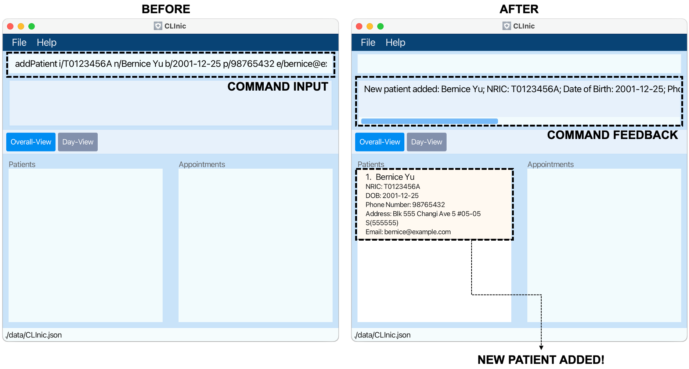
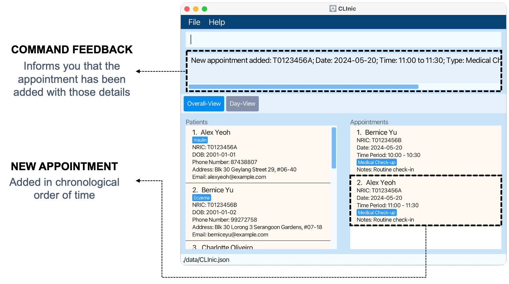

# CLInic User Guide

Welcome to **CLInic**, your dedicated digital assistant that can help you efficiently manage your patients and their appointments.

CLInic is tailored specifically for clinic assistants like yourself! Our goal? To create a seamless appointment management experience, allowing you more time to focus on what truly matters - your patients!

We understand that managing appointments in a clinic can be complex, but with CLInic, we hope to simplify this process for you. No more struggling with messy user interfaces and having too many buttons to click!
Our user-friendly interface and intuitive commands make it easy for you to:
* Manage patient's data
* Register appointments for patients
* Track the completion of appointments

So, let's get started! Whether you're familiar with the Command Line Interface (CLI) or need a bit of guidance, we're here to guide you every step of the way. Follow this User Guide to uncover the potential of CLInic!

<!-- * Table of Contents -->
<page-nav-print />

---

## Using this Guide

This User Guide contains all the essential information you need to use CLInic. For new users, we have detailed sections explaining the
[**installation**](#installing-clinic)  process, the [**design**](#orientation-to-clinic) of our interface and a simple
[**tutorial**](#tutorial-adding-an-appointment-for-a-new-patient) to get you familiarised with the basic commands.

Familarise yourselves with these terminologies! These definitions will be used throughout the User Guide:

| Term           | Explanation                                                                                                                                                     |
|----------------|-----------------------------------------------------------------------------------------------------------------------------------------------------------------|
| **CLI**        | Command Line Interface, a text-based interface for interacting with software by typing commands.                                                                |
| **GUI**        | Graphical User Interface, a visual interface that allows users to interact with software using graphical elements such as windows and buttons.                  |
| **JSON**       | JavaScript Object Notation, a lightweight data-interchange format.                                                                                              |
| **NRIC**       | National Registration Identity Card, a unique identifier for individuals in Singapore.                                                                          |
| **Command**    | An instruction given to CLInic to complete a certain task                                                                                                       |
| **Parameters** | An input value or field for a command                                                                                                                           |
| **Prefix**     | Keywords to tell the command what the input value is.  e.g. the prefix `n/` is used for name, so `n/John` tells the command that name to be input is "John" |
| **Shorthand**  | Command keyword which is short form for the full command equivalent but still works.   e.g. ep is shorthand for editPatient command                         |

Also, if you see these information boxes scattered throughout the User Guide, this is what they mean:

<box type="warning" seamless>

**Caution:** Warns you of potential causes of error
</box>

<box type="info" seamless>

**Note:** Highlights useful information that you should know
</box>

<box type="success" light>

**Success**: Highlights successful execution of command
</box>
<box type="wrong" light>

**Error**: Highlights failed execution of command

<box type="tip" seamless>

**What to Do:** Highlights possible solutions you can try to overcome the problem
</box>
</box>

---

## Quick Start

### Installing CLInic

Let's install CLInic together! Here are the step-by-step instructions on getting CLInic started. Don't worry, just follow the instructions for your operating system and you should be good to go!

1. System Requirements: Ensure you have <a href="https://www.oracle.com/java/technologies/downloads/#java11" target="_blank">**Java 11**</a> or above installed on your computer.

2. Download the latest `CLInic.jar` from <a href="https://github.com/AY2324S2-CS2103T-F10-3/tp/releases" target="_blank">**here**</a>.

3. Save the file to a location on your computer that will serve as your home folder for CLInic.

4. Open a command terminal on your computer. If you're unsure how to do this, we'll walk you through it.

  - **Windows**: Press `Win + R`, type `cmd`, and press `Enter`.

  - **MacOS**: Press `Cmd + Space`, type `Terminal`, and press `Enter`.
  - **Linux**: Press `Ctrl + Alt + T`.

5. Navigate to the folder where you saved the `CLInic.jar` file. If you saved it in your `Downloads` folder, you can use the following commands:

  - **Windows**: `cd Downloads`

  - **MacOS**: `cd ~/Downloads`
  - **Linux**: `cd ~/Downloads`

6. Type `java -jar CLInic.jar` command into terminal to run the application. 
   A GUI similar to the one below should appear in a few seconds. Note how the application contains some sample dummy data.

   

Simple, wasn't it? Let's now orientate you to the GUI and how CLInic works.

--- {.dashed}

 

### Orientation to CLInic

There are two different views in CLInic. **Command Input** and **Feedback** in both views are the same.  

#### Overall-View

**Overall-View** is the default view, allowing you to see all patients and appointments on one screen. This view is useful for finding patients or appointments, which you will learn how to do later!

#### Day-View

**Day-View** is the alternate view, allowing you to see all appointments scheduled today. This view is useful for you to manage upcoming appointments in the day.

For your easy reference, the table below outlines the purpose of each section.

| Section                          | Purpose                                                                                                |
|----------------------------------|--------------------------------------------------------------------------------------------------------|
| **Command Input**                | This is where you will write the commands you will learn later.                                        |
| **Command Feedback**             | This feedback box will show you success or error messages depending on the validity of commands input. |
| **View Toggle**                  | These buttons allow you to toggle between the Overall-View or Day-View.                                |
| **Patient List**                 | Shows you the list of patients in CLInic.                                                              |
| **Appointment List**             | Shows you the list of appointments scheduled in CLInic.                                                |
| **Appointment List for the Day** | Shows you the list of all appointments scheduled in the day, correct as at launch of the app.          |

#### Appointment Colour Coding

Appointments are colour-coded in CLInic, allowing you to easily identify the status of each appointment. The breakdown is as follows:

Great! You are now oriented to the layout of CLInic.

--- {.dashed}

 

### Tutorial: Adding an Appointment for a New Patient

Now that you've understood the layout of CLInic, let's get started with registering your very first patient and scheduling an appointment for them!
This step-by-step tutorial covers the essential commands of adding a patient and an appointment. Follow along with the instructions given and learn to write
your very first commands.

If this is your first time launching CLInic, you might see sample data being loaded. Let's clear them before adding our new patient!

* { text="1" t-size="32px" }

  On the Command Input Box, type the following command:

  <box>

  `clear`

  </box>

  Now press `Enter` on your keyboard.

  
  <box type="warning" seamless>

  **Caution:**  
  Commands in CLInic are case-sensitive! In order to ensure that your commands are recognised, ensure that they are of the same
  case as the commands given in the guide.
  </box>

  After executing the command, you should see that all the entries have been deleted (see right side of the image above).
  Wow! Just like that, you've successfully executed your very first command. Let's move on to something more challenging.

  Your first patient, Bernice, enters the clinic. Before we can schedule any appointments, we need to first register her patient details.
  This is achieved using the `addPatient` command. Let's learn how to use that.

* { text="2" t-size="32px" }

  On the Command Input Box, type the following command:

  <box>

  `addPatient i/T0123456A n/Bernice Yu b/2001-12-25 p/98765432 e/bernice@example.com a/Blk 555 Changi Ave 5 #05-05 S(555555)`

  </box>

Now press `Enter` on your keyboard.

You have now registered a patient of **NRIC**: T0123456A, **Name**: Bernice Yu, **Date of Birth (DOB)**: 2001-12-25, **Email**: bernice@example.com
and **Address**: Blk 555 Changi Ave 5 #05-05 S(555555) as seen on the right.

  <box type="info" seamless>

**Note:**  
In CLInic, we use [**prefixes**](#using-this-guide) to denote the input parameters.
The prefix `i/` is reserved for the patient's NRIC. Therefore, in this case, `i/ T0123456A` means that patient we wish to add has the NRIC `T0123456A`.
The remaining prefixes `n/`, `b/`, `p/`, `e/` and `a/` take in the patient's name, birth date, phone number, email and address respectively. The details and constraints of the prefixes and parameters required for each command will be documented in the features section.

  </box>

Awesome, you're learning fast! Now that Bernice is registered in our system, we can finally create an appointment for her.
We will need the `addAppt` command to do this!

* { text="3" t-size="32px" }

  On the Command Input Box, type the following command

  <box>

  `addAppt i/ T0123456A d/ 2024-05-06 from/ 10:00 to/ 11:00 t/ Medical Check-up`

  </box>

  Now press `Enter` on your keyboard.

  

  You have now created an appointment for Bernice using her **NRIC**: T0123456A. The details of her appointment are **Date**: 2024-05-06,
  **Start Time**: 10:00, **End Time**: 11:00 and **Appointment Type**: Medical Check-up as seen on the right.

  <box type="info" seamless>

  **Note:**  
  In CLInic, you will see that NRIC is used in most commands. We use NRIC numbers to identify each patient uniquely!
  </box>

  Well done! You have completed the tutorial! Your new patient, Bernice, now has an appointment scheduled for her.

  Continue on to the [**Features**](#features) section below to learn more about the full list of commands available in CLInic!
  If you are lost at anytime, typing the command **`help`** and pressing `Enter` will open the help window with a link that will lead you right back to this User Guide.

---

## Features

CLInic is designed to keep track of your patient data and appointment schedules. We have 3 broad categories of features:

1. [Patient Commands](#patientCommands)
2. [Appointment Commands](#appointmentCommands)
3. [General Commands](#generalCommands)

#### Command Format

<box type="info" seamless>

**Notes:**

* Words in `UPPER_CASE` are the parameters to be supplied by the user. 
  e.g. in `addPatient n/NAME`, `NAME` is a parameter which can be used as `addPatient n/John Doe`.

* Items in square brackets are optional. 
  e.g `n/NAME [t/TAG]` can be used as `n/John Doe t/friend` or as `n/John Doe`.

* Items with `…`​ after them can be used zero or more times. 
  e.g. `[t/TAG]…​` can be used as ` ` (i.e. 0 times), `t/friend`, `t/friend t/family` etc.

* Parameters can be in any order. 
  e.g. if the command specifies `n/NAME p/PHONE_NUMBER`, `p/PHONE_NUMBER n/NAME` is also acceptable.

* If you are using a PDF version of this document, be careful when copying and pasting commands that span multiple lines as space characters surrounding line-breaks may be omitted when copied over to the application.

</box>

<box type="warning" seamless>

**Caution:**  
Commands are case-sensitive, including shorthand formats. 
e.g Invalid commands like `AddPatient`, `addpatient`, `Addpatient`, `AP`, `aP` and `Ap` will not be recognised by CLInic.

</box>

--- {.dashed}

 

### 1. Patient Commands

CLInic stores your patients with the following information fields: NRIC (unique), Name, Date of Birth, Phone Number, Email, Address, Medical Allergies (if any).

#### Patient Commands Prefixes and Parameters

For your easy reference, this table below provides details of all the prefixes used in **Patient Commands**. Each prefix corresponds to a parameter and comes with a set of
constraints documenting what works and what doesn't! For prefixes used in Appointment commands, see [here](#appointment-commands-prefixes-and-parameters).

 Prefix | Parameter                                                            | Constraints                                                                                                                                                                                                                                                                                                                                          |
|----------------|---------------------------------------------------------------------------------|------------------------------------------------------------------------------------------------------------------------------------------------------------------------------------------------------------------------------------------------------------------------------------------------------------------------------------------------------|
| **i/**         | Unique ID in Singapore's context - NRIC (e.g. `T0123456A`)                      | - NRICs must start and end with capital letters with 7 numbers in between them  - Possible invalid NRICs not accounted for due to uncertainty in checksum of Singapore's system and FIN numbers   - Also allowing for NRICs beyond current date e.g. `T99...` to allow flexibility of app without having to constantly readjust fields   | 
| **n/**         | Name of patient.                                                                | - Names are restricted to 55 alphanumeric characters.   - Extra spacing is allowed within the name to allow for user convenience and flexibility.                                                                                                                                                                                                |
| **b/**         | Date of birth of patient.                                                       | - Dates must be in YYYY-MM-DD format. - Only allows valid dates after 1900-01-01.                                                                                                                                                                                                                                                                |
| **p/**         | Phone number / Emergency contact number.                                        | - Phone numbers must contain 8 numbers. - Only Singapore phone numbers allowed.   - Duplicate phone numbers allowed in case of children with parent's contact number.                                                                                                                                                                        |
| **e/**         | Email of patient.                                                               | - Emails follow the format of [local-part]@[domain] - Domain portion must contain at least 2 characters.                                                                                                                                                                                                                                         |
| **a/**         | Address of patient.                                                             | - Addresses are restricted to 60 alphanumeric characters.                                                                                                                                                                                                                                                                                            |
| **t/**         | Tag attached to specify patient's medical allergies. e.g. `Paracetamol, Insulin` | - Each medical allergy tag is restricted to 30 alphanumeric characters with no spaces in between   - It is recommended to use this tag for medical allergies but there are otherwise no restrictions on other use cases                                                                                                                                                                                                                                        
| **newn/**      | New name of patient if change required.                                         | - As per constraints in `n/`                                                                                                                                                                                                                                                                                                                         |
| **newp/**      | New phone number of patient if change required.                                 | - As per constraints in `p/`                                                                                                                                                                                                                                                                                                                         |
| **newe/**      | New email of patient if change required.                                        | - As per constraints in `e/`                                                                                                                                                                                                                                                                                                                         |
| **newa/**      | New address of patient if change required.                                      | - As per constraints in `a/`                                                                                                                                                                                                                                                                                                                         
| **newt/**      | New tag of patient if change required.                                          | - As per constraints in `t/`                                                                                                                                                                                                                                                                                                                         

<box type="wrong" light>

**Possible invalid input fields.**
<box type="tip" seamless>

Some of the inputs you have keyed in may be invalid, check out the constraints for the input fields above to understand what values CLInic accepts.
</box>
</box>

 

### 1.1 Adding a patient: `addPatient` OR `ap`

Use this command if you wish to add a new patient to CLInic. You would be required to specify important patient personal information and can include the patient's medical allergies, if any.

**Format:**
<box>

Full:
>`addPatient i/NRIC n/NAME b/DOB p/PHONE_NUMBER e/EMAIL a/ADDRESS [t/MEDICAL_ALLERGY]…​ `

Shorthand:
> `ap i/NRIC n/NAME  b/DOB p/PHONE_NUMBER e/EMAIL a/ADDRESS [t/MEDICAL_ALLERGY]…​`

</box>

[More information on prefixes & parameters](#patient-commands-prefixes-and-parameters)

<box type="warning" seamless>

**Caution:**  
A patient must have a unique NRIC in CLInic.

</box>

**Examples:**
<box>

Adds a patient whose NRIC is T0123456A, name is John Doe, is born on 2nd May 2001, has a phone number of 98765432, has an email of johnd@example.com, resides at John street, block 123, #01-01, and has no allergies.

>`addPatient i/T0123456A n/John Doe b/2001-05-02 p/98765432 e/johnd@example.com a/John street, block 123, #01-01`
</box>
<box>

Adds a patient whose NRIC is S9876543A, name is Betsy Crowe, is born on 3nd Feb 1998, has a phone number of 91234567, has an email of betsycrowe@example.com, resides at Crowe street, block 234, #12-12, and is allergic to Paracetamol and Insulin.

>`ap i/S9876543A n/Betsy Crowe b/1998-02-03 t/Insulin e/betsycrowe@example.com a/Crowe street, block 234, #12-12 p/91234567 t/Paracetamol`
</box>

<box type="success" light>

**Expected Outcome**:

</box>

<box type="wrong" light>

**This patient already exists in CLInic.**

<box type="tip" seamless>

There already exists a patient with the NRIC you specified. To view the details of that patient, you can use the [findPatient](#findPatient) command.
</box>
</box>

 

### 1.2 Deleting a Patient : `deletePatient` OR `dp`

Use this command if you wish to delete a patient from CLInic.

<box type="warning" seamless>

**Caution:**  
Corresponding appointments for the specified patient will be deleted from CLInic too.

</box>

**Format:**
<box>

Full:
>`deletePatient i/NRIC`

Shorthand:
>`dp i/NRIC`

</box>

[More information on prefixes & parameters](#patient-commands-prefixes-and-parameters)

**Examples:**
<box>

Delete patient with NRIC number S9876543A.

>`deletePatient i/S9876543A`
</box>

<box type="wrong" light>

**The NRIC provided is not found in the system.**

<box type="tip" seamless>

CLInic does not have a patient with the provided NRIC, please double-check the NRIC provided.
</box>
</box>

 

### 1.3 Editing a Patient : `editPatient` OR `ep`

Use this command if you wish to edit an existing patient in CLInic.

**Format:**
<box>

Full:
>`editPatient i/NRIC [newn/NEW_NAME] [newb/NEW_DOB] [newp/NEW_PHONE] [newe/NEW_EMAIL] [newa/NEW_ADDRESS] [newt/NEW_MEDICAL_ALLERGY]…​`

Shorthand:
>`ep i/NRIC [newn/NEW_NAME] [newb/NEW_DOB] [newp/NEW_PHONE] [newe/NEW_EMAIL] [newa/NEW_ADDRESS] [newt/NEW_MEDICAL_ALLERGY]…​`

</box>

[More information on prefixes & parameters](#patient-commands-prefixes-and-parameters)

<box type="warning" seamless>

**Caution:**
* Existing values will be updated to the input values.

* When editing tags, existing tags of the patient will be removed, i.e., adding tags is not cumulative. Use t/ to remove all tags.

</box>

<box type="info" seamless>

**Note:**  
CLInic does not allow you to edit a patient's NRIC to maintain system data integrity.

</box>

**Examples:**
<box>

Edits the phone number and email address of the patient with NRIC:`T0123456A` to be `91234567` and `johndoe@example.com` respectively.

>`editPatient i/T0123456A newp/91234567 newe/johndoe@example.com`
</box>

<box>

Edits the name of the patient with NRIC:`S8765432Z` to be `Betsy Crower` and clears all existing tags.

>`editPatient i/S98765432A newn/Betsy Crower newt/`
</box>

<box type="wrong" light>

**At least one field to edit must be provided.**

<box type="tip" seamless>

CLInic requires that at least one optional field is provided to execute the `editPatient` command.
</box>
</box>

<box type="wrong" light>

**The NRIC provided is not found in the system.**

<box type="tip" seamless>

CLInic does not have a patient with the provided NRIC, please double-check the NRIC provided or create a Patient using the [addPatient](#addPatient) command.
</box>
</box>

 

### 1.4 Finding Patients: `findPatient` OR `fp`

Use this command if you wish to finds patients whose name OR NRIC fit the given keywords.

**Format:**
<box>

Full: `findPatient n/NAME_KEYWORD [MORE_NAME_KEYWORDS]` OR `findPatient i/NRIC_KEYWORD`

Shorthand: `fp n/NAME_KEYWORD [MORE_NAME_KEYWORDS]` OR `fp i/NRIC_KEYWORD`
</box>

[More information on prefixes & parameters](#patient-commands-prefixes-and-parameters)

<box type="info" seamless>

**Note:**
* The search is case-insensitive. e.g `hans` will match `Hans`.

* Partial words will be matched only if the start of the word is the same e.g. `T01` will match `T0123456A`.

* To accommodate for future extensions, special characters can be searched. However, no search results may be found as special characters are currently not supported in `NAME` and `NRIC`.

* If currently on Day-View, this command will cause a <a href=#switchView>switchView</a> to automatically occur.
  </box>

<box type="wrong" light>

**Find by either NRIC or name, not both!**

<box type="tip" seamless>

CLInic currently only supports finding patients by a single field.
</box>
</box>

 

#### 1.4.1 Find by Name

**Examples:**
<box>

Find all patients whose name begins with `john`

>`findPatient n/John`
</box>

**Examples:**
<box>

Find all patients whose name begins with either `alex` or `david`, using shorthand command

>`fp n/ alex david`
</box>

<box type="success" light>

**Expected Outcome**:

</box>

 

#### 1.4.2 Find by NRIC
**Examples:**
<box>

Find all patients with NRIC born in the year 2001, with NRIC starting with `t01`

>`findPatient i/t01`
</box>

<box type="success" light>

**Expected Outcome**:

</box>

<box type="wrong" light>

**You have provided more than one word of NRIC keywords to match.**

<box type="tip" seamless>

CLInic does not provide support for finding patients with different starting NRICs. Please only provide one starting NRIC.

e.g. `i/T01 T012` will NOT return `T0123456A` as the given keyword is `T01 T012`
</box>
</box>

--- {.dashed}

 

###  2. Appointment Commands

CLInic stores your appointments with the following information fields: NRIC (unique), Date, Start Time, End Time, Appointment Type, Note (if any).

#### Appointment Commands Prefixes and Parameters

For your easy reference, the table below provides details of all the prefixes used in **Appointment Commands**. Each prefix corresponds to a parameter and comes with a set of
constraints documenting what works and what doesn't! For prefixes used in Patient commands, see [here](#patient-commands-prefixes-and-parameters).

| Prefix           | Parameter                                                  | Constraints                                                                                                                                                                                                                                                                                                                                           
|------------------|------------------------------------------------------------|-------------------------------------------------------------------------------------------------------------------------------------------------------------------------------------------------------------------------------------------------------------------------------------------------------------------------------------------------------|
| **i/**           | Unique ID in Singapore's context - NRIC (e.g. `T0123456A`) | - NRICs must start and end with capital letters with 7 numbers in between them   - Possible invalid NRICs not accounted for due to uncertainty in checksum of Singapore's system and FIN numbers   - Also allowing for NRICs beyond current date e.g. `T99...` to allow flexibility of app without having to constantly readjust fields   | 
| **d/**           | Date of appointment                                        | - Dates must be in YYYY-MM-DD format   - Only allows valid dates after 1900-01-01                                                                                                                                                                                                                                                                 |                                                                                                                                                                                                                                                         |
| **from/**        | Start time of appointment                                  | - Time in HH:mm format   - Start time has to be earlier than end time                                                                                                                                                                                                                                                                         |
| **to/**          | End time of appointment                                    | - Time in HH:mm format    - End time has to be later than start time   - `to/` timing is taken to be on same day as `from/`                                                                                                                                                                                                                |
| **t/**           | Appointment type                                           | - Appointment type cannot be empty and is restricted to 30 characters   - It is recommended to use this for types of visits e.g. `Medical check-up` but there is no restriction on other use cases                                                                                                                                                                                                                                 
| **note/**        | Additional notes for appointment                           | - Appointment note is restricted to 70 characters   - It is recommended to use this for notes e.g. `Chinese speaking` but there is no restriction on other use cases                                                                                                                                                                                                                              
| **newd/**        | New date of appointment if change required.                | - As per constraints in `d/`                                                                                                                                                                                                                                                                                                                           
| **newfrom/**     | New start time of appointment if change required.          | - As per constraints in `from/`                                                                                                                                                                                                                                                                                                                         
| **newto/**       | New end time of appointment if change required.            | - As per constraints in `to/`                                                                                                                                                                                                                                                                                                                           
| **newt/**        | New type of appointment if change required.                | - As per constraints in `t/`                                                                                                                                                                                                                                                                                                                            
| **newnote/**     | New note of appointment if change required.                | - As per constraints in `note/`                                                                                                                                                                                                                                                                                                                         

<box type="wrong" light>

**Possible invalid input fields.**

<box type="tip" seamless>

Some of the inputs you have keyed in may be invalid, check out the constraints for the input fields above to understand what values CLInic accepts.

</box>
</box>

 

### 2.1 Adding an Appointment: `addAppt` OR `aa`

Use this command if you wish to add an appointment to CLInic.

**Format:**

<box>

Full:

> `addAppt i/NRIC d/DATE from/START_TIME to/END_TIME t/APPOINTMENT_TYPE [note/NOTE]`  

Shorthand:

> `aa i/NRIC d/DATE from/START_TIME to/END_TIME t/APPOINTMENT_TYPE [note/NOTE]`

</box>

[More information on prefixes & parameters](#appointment-commands-prefixes-and-parameters)

<box type="warning" seamless>

**Caution:**  
You cannot schedule an appointment for a patient on a date before their date of birth.</box>

**Examples:**
<box>

Add appointment for patient whose IC is T0123456A and is coming on 2024-05-20 from 11:00 to 11:30 for a Medical Check-up with a note Routine check-in.

> `addAppt i/T0123456A d/2024-05-20 from/11:00 to/11:30 t/Medical Check-up note/Routine check-in`
</box>

<box>

Add appointment, using shorthand command, with above example.

> `aa i/T0123456A d/2024-05-20 from/11:00 to/11:30 t/Medical Check-up note/Routine check-in`

</box>

<box type="success" light>

**Expected Outcome**:

</box>

<box type="wrong" light>

**The NRIC provided is not found in the system.**

<box type="tip" seamless>

CLInic does not have a patient with the provided NRIC, please double-check the NRIC provided or create a Patient using the [addPatient](#addPatient) command.
</box>
</box>

<box type="wrong" light>

**End time of appointment cannot be earlier than start time.**

<box type="tip" seamless>

Appointments should not have an end time that is earlier than the start time, you should check the times keyed in for `from/` and `to/`.

</box>
</box>

<box type="wrong" light>

**New appointment overlaps with an existing appointment for the same patient.**

<box type="tip" seamless>

On Overall-View, the appointment list will be updated to show the list of all appointments for that patient on that date.
This is for your ease in finding an alternate time slot for the new appointment to be added. If currently on Day-View, see <a href=#switchView>here</a>.

</box>
</box>

</box>

 

### 2.2 Deleting an Appointment: `deleteAppt` OR `da`

Use this command if you wish to delete an appointment from CLInic.

**Format:**

<box>

Full:

> `deleteAppt i/NRIC d/DATE from/START_TIME`  

Shorthand:

> `da i/NRIC d/DATE from/START_TIME`

</box>

[More information on prefixes & parameters](#appointment-commands-prefixes-and-parameters)

**Examples:**

<box>

Delete appointment for patient whose IC is T0123456A on 2024-05-20 starting from 11:00.

> `deleteAppt i/T0123456A d/2024-05-20 from/11:00`

</box>

<box>

Delete appointment, using shorthand command, with above example.

> `da i/T0123456A d/2024-05-20 from/11:00`

</box>

<box type="wrong" light>

**The appointment provided is not found in the system**.

<box type="tip" seamless>

CLInic does not have an appointment with the provided NRIC, date and start time, you should double-check the details provided.

</box>
</box>

 

### 2.3 Editing an Appointment : `editAppt` OR `ea`

Use this command if you wish to edit an existing appointment in CLInic.
Existing values will be updated to the input values.

**Format:**

<box>

Full:

> `editAppt i/NRIC d/DATE from/START_TIME [newd/NEW_DATE] [newfrom/NEW_START_TIME] [newto/NEW_END_TIME] [newt/NEW_APPOINTMENT_TYPE] [newnote/NEW_NOTE]`  

Shorthand:

> `ea i/NRIC d/DATE from/START_TIME [newd/NEW_DATE] [newfrom/NEW_START_TIME] [newto/NEW_END_TIME] [newt/NEW_APPOINTMENT_TYPE] [newnote/NEW_NOTE]`

</box>

[More information on prefixes & parameters](#appointment-commands-prefixes-and-parameters)

**Examples:**

<box>

Edit the date of the appointment with NRIC:T0123456A, Date: 2024-05-20, Start Time: 11:00, to be 2024-05-21 instead.

> `editAppt i/T0123456A d/2024-05-20 from/11:00 newd/2024-05-21`

</box>

<box>

Edit appointment, using shorthand, with the above example.

> `ea i/T0123456A d/2024-05-20 from/11:00 newd/2024-02-21`

</box>

<box>

Clears note for appointment.

> `editAppt i/S8743880A d/2024-10-20 from/14:00 newnote/`

</box>

<box type="wrong" light>

**At least one field to edit must be provided.**

<box type="tip" seamless>

CLInic requires that at least one optional field is provided to execute the `editAppt` command.
</box>
</box>

<box type="wrong" light>

**The appointment provided is not found in the system**.

<box type="tip" seamless>

CLInic does not have an appointment with the provided NRIC, date and start time, you should double-check the details provided.

</box>
</box>

<box type="wrong" light>

**Edited appointment information overlaps with an existing appointment for the same patient**

<box type="tip" seamless>

On Overall-View, the appointment list will be updated to show the list of all appointments for that patient on that date.
This is for your ease in finding an alternate time slot for the appointment to be edited into. If currently on Day-View, see <a href=#switchView>here</a>.

</box>
</box>

 

### 2.4 Finding Appointments: `findAppt` OR `fa`

Use this command if you wish to find appointments based on certain identifiers.
You can use any combination of the three: NRIC, date or start time.

**Format:**
<box>

Full:

> `findAppt [i/NRIC] [d/DATE] [from/START_TIME]`

Shorthand:

> `fa [i/NRIC] [d/DATE] [from/START_TIME]`

</box>

[More information on prefixes & parameters](#appointment-commands-prefixes-and-parameters)

<box type="info" seamless>

**Note:**  
If currently on Day-View, this command will cause a <a href=#switchView>switchView</a> to automatically occur.

</box>

**Examples:**

<box>

Find all appointments for patient with NRIC T0123456A on 2024-05-20 starting from 11:00 and later.

> `findAppt i/T0123456A d/2024-05-20 from/11:00`

</box>

<box>

Find all appointments, using shorthand command, on 2024-05-20, starting from 11:00 and later.

> `fa d/2024-05-20 from/11:00`

</box>

 

#### 2.4.1 Find by NRIC

**Examples:**

<box>

Find all appointments for patient with exact NRIC T0123456A.

> `findAppt i/T0123456A`

</box>

<box type="warning" seamless>

**Caution:**
* If NRIC does not exist within CLInic, no appointments will be returned to you.

* Please ensure existence of patient with NRIC within CLInic.

</box>

 

#### 2.4.2 Find by Date

**Examples:**

<box>

Finds all appointments on the date 2024-05-20.

> `findAppt d/2024-05-20`

</box>

 

#### 2.4.3 Find by Time

**Examples:**

<box>

Finds all appointments starting from 11:00 and later on any date.

> `findAppt from/11:00`

</box>

<box type="success" light>

**Expected Outcome**:

</box>

 

### 2.5 Marking an Appointment: `mark`

Use this command if you wish to mark an appointment as attended from CLInic.

**Format:**
<box>

> `mark i/NRIC d/DATE from/START_TIME`

</box>

[More information on prefixes & parameters](#appointment-commands-prefixes-and-parameters)

<box type="warning" seamless>

**Caution:**  
You can mark a marked appointment. The appointment will remain marked and no errors will be raised.

</box>

<box type="info" seamless>

**Note:**  
Marking an appointment will cause its colour to change to green.

</box>

**Examples:**

<box>

Mark appointment for the patient with NRIC T0123456A, on 2024-05-20 from 11:00.

> `mark i/T0123456A d/2024-05-20 from/11:00`

</box>

</box>

<box type="success" light>

**Expected Outcome**:

</box>

<box type="wrong" light>

**The appointment provided is not found in the system**.

<box type="tip" seamless>

CLInic does not have an appointment with the provided NRIC, date and start time, you should double-check the details provided.

</box>
</box>

 

### 2.6 Unmarking an Appointment: `unmark`

Use this command if you wish to unmark an appointment from CLInic.

**Format:**
<box>

> `unmark i/NRIC d/DATE from/START_TIME`

</box>

[More information on prefixes & parameters](#appointment-commands-prefixes-and-parameters)

<box type="warning" seamless>

**Caution:**  
You can unmark an appointment that is not marked. Appointment will remain unmarked and there will be no errors raised.

</box>

<box type="info" seamless>

**Note:**  
Unmarking an appointment will cause its colour to change to red (if past scheduled timing) or beige.

</box>

**Examples:**

<box>

Unmark appointment for the patient with NRIC T0123456A, on 2024-05-20 from 11:00.

> `unmark i/T0123456A d/2024-05-20 from/11:00`

</box>

<box type="wrong" light>

**The appointment provided is not found in the system**.

<box type="tip" seamless>

CLInic does not have an appointment with the provided NRIC, date and start time, you should double-check the details provided.

</box>
</box>

--- {.dashed}

 

### 3. General Commands

General commands are simple commands with no prefixes.

<box type="info" seamless>

**Note:**  
Any extraneous parameters for these commands will be ignored.

e.g. `list 123` will be interpreted as `list`
</box>

 

### 3.1 Listing All Patients and Appointments : `list` OR `ls`

Use this command to show the full list of all patients and appointments in CLInic.

<box type="info" seamless>

**Note:**  
This command is useful for reinstating the full list of patients and appointments on Day-View after commands like `findPatient` or `findAppointment`.
</box>

**Format:**
<box>

Full:
> `list`

Shorthand:
> `ls​`
</box>

 

### 3.2 Switch between Overall-View and Day-View : `switchView` OR `sv`

You can use this command to switch views from Overall-View to Day-View and vice versa, without having to click on buttons on the interface.

**Format:**
<box>

Full:
> `switchView`

Shorthand:
> `sv`

</box>

 

### 3.3 Clearing All Entries : `clear`

Use this command if you wish to clear all entries of patients and appointments from CLInic.

**Format:**
<box>

> `clear`
</box>

<box type="warning" seamless>

**Caution:** 
* This action is irreversible. Please proceed with caution.

* Once this command is executed, it would not be possible to restore the deleted data.

</box>

 

### 3.4 Exiting the Program : `exit`

Use this command if you wish to close and exit CLInic.

**Format:**
<box>

> `exit`

</box>

 

### 3.5 Viewing Help : `help`

If you are facing any issues while using CLInic, you can use this help command which will provide you with a link to this User Guide.

**Format:**
<box>

> `help`
</box>

<box type="success" light>

**Expected Outcome**:

</box>

 

### Saving the Data

CLInic data are saved in the hard disk automatically after any command that changes the data. You do not need to save manually.

 

### Editing the Data File

CLInic data are saved automatically as a JSON file `[JAR file location]/data/CLInic.json`. Advanced users are welcome to update data directly by editing that data file.

<box type="warning" seamless>

**Caution:**
If your changes to the data file makes its format invalid, CLInic will discard all data and start with an empty data file at the next run.  Hence, it is recommended to take a backup of the file before editing it. 
Furthermore, certain edits can cause the CLInic to behave in unexpected ways (e.g., if a value entered is outside the acceptable range). Therefore, edit the data file only if you are confident that you can update it correctly.
</box>

--------------------------------------------------------------------------------------------------------------------

## FAQ

##### Patients
<box>

**Q**: Why are the `EMAIL` and `PHONE_NUMBER` fields compulsory? 
>**A**: Emergency contact details are necessary even for children or elderly. In such cases, their `EMAIL` and `PHONE_NUMBER` can be completed with their guardian's contact details.

</box>
<box>

**Q**: Will `EMAIL` accept emails without an .xx domain? Will valid emails like user@local be accepted? 
>**A**: Yes, CLInic would like to allow you to have flexibility in emails accepted, as to allow compatibility with legacy systems or to align with your specific network configuration and security protocols. However, special characters such as slashes `/` are often not allowed as part of email domains or names, hence we decided to restrict that.

</box>
<box>

**Q**: Will foreign ID or phone numbers be accepted? 
>**A**: Foreign ID and phone numbers are currently not supported by CLInic as we roll out the basic functionalities suited to a local context. However, we have plans to implement this.

</box>
<box>

**Q**: Am I able to put NA for the `ADDRESS` field? 
>**A**: CLInic does not allow the address field to be blank, as an address can be essential in medical emergencies. However, you can opt to fill it with a `-` if you deem fit.

</box>
<box>

**Q**: Why am I allowed to add duplicate phone numbers for different patients? 
>**A**: CLInic accounts for events where both a child and their parent are patients, or patients are related. In these events, these patients may decide to provide the same phone number as their contact details.

</box>
<box>

**Q**: Am I allowed to edit a patient's `NRIC`? 
>**A**: No, CLInic does not support editing a patient's NRIC. We decided on this to protect against data manipulation and errors. Should a patient change their NRIC, you can use the <a href=#addPatient>addPatient command</a>.

</box>
<box>

**Q**: Why is there a character limit to `NAME`? 
>**A**: This is to ensure that it complies with the Singapore standard of NRIC names which has a limit of 54 characters. As clinics have to verify patient name with their physical NRIC, CLInic has built in this restriction. It also ensures that the patient's name appears on the GUI well.

</box>

##### Appointments
<box>

**Q**: I'm editing an appointment, and the new appointment information is flagged as overlapping. What can I do? 
>**A**: When the new time slot you input overlaps with an existing appointment, CLInic will show you all the existing appointments for the same date you had hoped would be free. This way, you can simply choose a time that does not overlap with those existing appointments.

</box>
<box>

**Q**: Is marking future appointments allowed? Is adding past appointments allowed?  
>**A**: Yes, CLInic supports you in the flexibility of marking and adding appointments. If a patient decides to turn up early, or walk-in on the day, you can easily mark a future appointment. If you forgot to add a past appointment, you can do so retroactively.

</box>
<box>

**Q**: Does editing a marked appointment to the future change its status to unmarked? 
>**A**: No, CLInic allows you to move appointments independently of if they were marked, such that you can have flexibility in scheduling of appointments.

</box>

##### General
<box>

**Q**: As a new user, should I change the order of prefixes? 
>**A**: CLInic recommends that you follow the example order of prefixes to get the hang of it first, before moving on to more flexible and advanced work flows.

</box>
<box>

**Q**: Why does `APPOINTMENT_TYPE` and `MEDICAL_ALLERGY` use the same prefix `t/`? 
>**A**: `APPOINTMENT_TYPE` and `MEDICAL_ALLERGY` tags appointments and patients respectively. They also appear quite similar in the GUI. Hence, we decided to use the same prefix to make it easier for you to remember.

</box>
<box>

**Q**: What does "Unknown Command" mean? What should I do if I encounter it? 
>**A**: "Unknown Command" means that you have used a different syntax or unsupported command. Refer to [features](#features) for valid commands.

</box>
<box>

**Q**: Can I use CLInic overseas? 
>**A**: CLInic is intended to be used in Singapore and not on the go. Using it overseas will not update appointment times.

</box>

<box>

**Q**: Why does CLInic use `NRIC` rather than an index for identifying patients and appointments? 
>**A**: Using the unique `NRIC` prevents errors that could be costly, especially in the healthcare industry.

</box>

<box>

**Q**: How do I transfer my data to another Computer? 
>**A**: Install the app in the other computer and overwrite the empty data file it creates with the file that contains the data of your previous CLInic home folder.

</box>

--------------------------------------------------------------------------------------------------------------------

## Known issues

1. **When using multiple screens**, if you move the application to a secondary screen, and later switch to using only the primary screen, the GUI will open off-screen. The remedy is to delete the `preferences.json` file created by the application before running the application again.
2. **When missing read/write permissions**, the application may not work. Ensure that read/write permissions are enabled for CLInic.

--------------------------------------------------------------------------------------------------------------------

## Command summary
| Action            | Format                                                                                                                                                                                                                                                                                                                      |
|-------------------|-----------------------------------------------------------------------------------------------------------------------------------------------------------------------------------------------------------------------------------------------------------------------------------------------------------------------------|
| **AddPatient**    | Full: `addPatient i/NRIC n/NAME b/DOB p/PHONE_NUMBER e/EMAIL a/ADDRESS [t/MEDICAL_ALLERGY]…​`   Shorthand: `ap i/NRIC n/NAME b/DOB p/PHONE_NUMBER e/EMAIL a/ADDRESS [t/MEDICAL_ALLERGY]…​`                                                                                                                               |
| **DeletePatient** | Full: `deletePatient i/NRIC`  Shorthand: `dp i/NRIC`                                                                                                                                                                                                                                                                     |                                                                 |
| **EditPatient**   | Full: `editPatient i/NRIC [newn/NEW_NAME] [newp/NEW_PHONE_NUMBER] [newe/NEW_EMAIL] [newa/NEW_ADDRESS] [newt/NEW_TAG]…​`  Shorthand: `ep i/NRIC [newn/NEW_NAME] [newp/NEW_PHONE_NUMBER] [newe/NEW_EMAIL] [newa/NEW_ADDRESS] [newt/NEW_TAG]…​`                                                                             |
| **FindPatient**   | Full: `findPatient n/NAME_KEYWORD [MORE_NAME_KEYWORDS]` OR `findPatient i/NRIC_KEYWORD`   Shorthand: `fp n/NAME_KEYWORD [MORE_NAME_KEYWORDS]` OR `fp i/NRIC_KEYWORD`                                                                                                                                                     |
| **AddAppt**       | Full: `addAppt i/NRIC d/DATE from/START_TIME to/END_TIME t/APPOINTMENT_TYPE note/NOTE`  Shorthand: `aa i/NRIC d/DATE from/START_TIME to/END_TIME t/APPOINTMENT_TYPE note/NOTE`                                                                                                                                           |
| **DeleteAppt**    | Full: `deleteAppt i/NRIC d/DATE from/START_TIME`   Shorthand: `da i/NRIC d/DATE from/START_TIME`                                                                                                                                                                                                                         |
| **EditAppt**      | Full: `editAppt i/NRIC d/DATE from/START_TIME [newd/NEW_DATE] [newfrom/NEW_START_TIME] [newto/NEW_END_TIME] [newt/NEW_APPOINTMENT_TYPE] [newnote/NEW_NOTE]`   Shorthand: `ea i/NRIC d/DATE from/START_TIME [newd/NEW_DATE] [newfrom/NEW_START_TIME] [newto/NEW_END_TIME] [newt/NEW_APPOINTMENT_TYPE] [newnote/NEW_NOTE]` |
| **FindAppt**      | Full: `findAppt [i/NRIC] [d/DATE] [from/START_TIME]`   Shorthand: `fa [i/NRIC] [d/DATE] [from/START_TIME]`                                                                                                                                                                                                               |
| **Mark**          | `mark i/NRIC d/DATE from/START_TIME`                                                                                                                                                                                                                                                                                        |
| **Unmark**        | `unmark i/NRIC d/DATE from/START_TIME`                                                                                                                                                                                                                                                                                      |
| **List**          | Full: `list`   Shorthand: `ls`                                                                                                                                                                                                                                                                                           |                                                                                                                                                                                                                                                                                                                      
| **SwitchView**    | Full: `switchView`    Shorthand: `sv`                                                                                                                                                                                                                                                                                    
| **Clear**         | `clear`                                                                                                                                                                                                                                                                                                                     |
| **Exit**          | `exit`                                                                                                                                                                                                                                                                                                                      |
| **Help**          | `help`                                                                                                                                                                                                                                                                                                                      |

